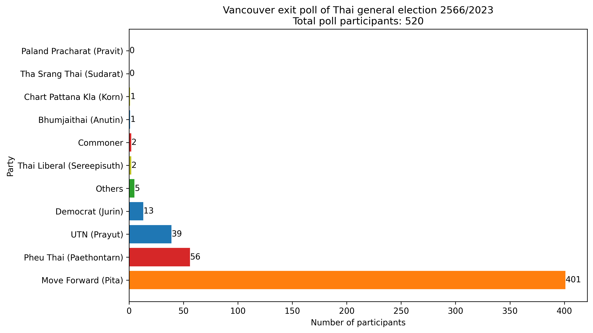
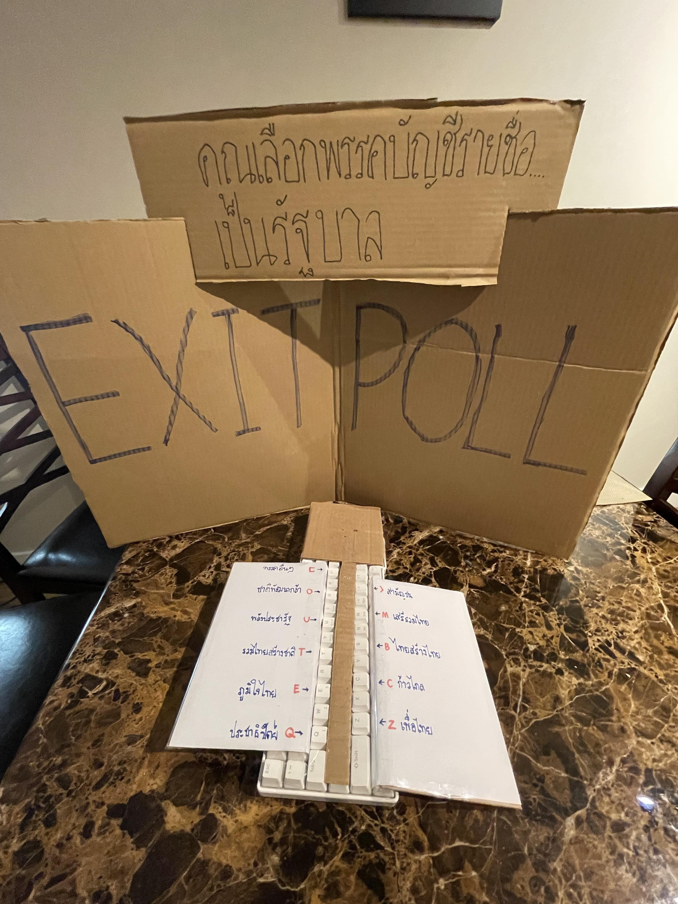

# VancouverExitPoll2566

Vancouver exit poll of Thai general election 2566/2023

Exit Poll วันที่ 29-30 เมษายน 2566 

## สาระสังเขป

หลังจากที่แก้ไขปัญหาในข้อมูลตามข้อสังเกต เห็นได้ว่าผู้มาใช้สิทธิด้วยตัวเองในนครแวนคูเวอร์ แคนาดา ได้ลงเลือกบัตรบัญชีรายชื่อตามนี้



จำนวนคนตอบโพลล์ประมาณ 97.5% ของผู้ใช้สิทธิ

## วิธีการเก็บข้อมูล

เขียน `exit-poll.py` ทำหน้าที่เป็น keylogger แล้วเขียนป้ายติดกับตัวคีย์บอร์ดเพื่อให้ผู้ใช้โพลล์กดปุ่มที่ตรงกับพรรคที่เลือกได้ถูก การวางปุ่มเว้นปุ่ม เป็นการป้องกันการกดผิดเพราะปุ่มใกล้กันเกินไป



โดยรายชื่อพรรคที่นำมาสอบถาม นำมาจากพรรคแนวหน้าที่ร่วมลง[ดีเบตสรยุทธ เปลี่ยนใหม่หรือไปต่อ ตอนตัวเต็ง](https://www.youtube.com/watch?v=0TDHSlGd6BE) ผู้จัดได้สังเกตว่ามีปุ่มเหลือหนึ่งปุ่ม จึงได้มีพรรคสามัญชนให้เป็นทางเลือกด้วย

เราได้ตั้งโต๊ะแถวๆบันไดทางเข้าออกชั้น เพื่อให้ ผู้ใช้สิทธิ์เดินผ่านแล้วมองเห็นได้อย่างสะดวก โดยเรามีทีมงานหนุ่มหล่อๆ (เพื่อนผมเอง จีบได้ๆ 555) มาช่วยเรียกให้ผู้ใช้สิทธิ เดินเข้ามากดโพลล์ และอธิบายขั้นตอนการลงเสียง ว่าแค่ต้องกดพรรคที่เลือก แค่ครั้งเดียว

เราได้คิดถึงวิธีการสอบถามแบบอื่น แต่คิดว่าวิธีอื่นนั้นมีปัญหาของมัน เช่น

- ให้คนถือกระดานถาม ข้อมูลที่ได้จะไม่ได้อยู่รูปแบบดิจิตอลเลยทำให้ยากซึ่งการประมวลผลข้อมูล และอาจทำให้คนหลายกลุ่มไม่ทำโพลล์ เพราะความอายกับการคุยกับคนแปลกหน้าเรื่องการเมือง
- การใช้แบบสอบถามออนไลน์ เช่น Google forms ทำให้กลุ่มคนที่ไม่ค่อยถนัดเทคโนโลยีมาทำโพลล์ไม่สำเร็จ และการกรอกแบบสอบถามนั่นใช้เวลานานกว่าการกดปุ่มหรือการตอบคำถามปากเปล่า คนที่ไม่มีเวลาอาจจะไม่มาลงเสียง

เราจึงคิดว่า วิธีนี้น่าจะได้ผลที่สุด แม้ว่าการลงเสียงโพลล์โดยการใช้ keylogger อาจจะเป็นเทคโนโลยีใหม่ที่คนไม่คุ้นเคยและต้องการคำอธิบายก็ตาม

คำถามที่ตั้งคือ “คุณเลือกพรรคบัญชีรายชื่อ … เป็นรัฐบาล” ถามแค่เฉพาะบัญชีรายชื่อเพื่อความง่ายของการตอบ และในหลายเขต พรรคในดวงใจอาจไม่มีผู้ลงสมัคร หรือผู้ใช้สิทธิอาจเลือกพรรคที่ไม่ได้ชอบที่สุด เพราะเลือกเชิงยุทธศาสตร์ โดยการถามแบบนี้ น่าจะทำให้ได้คำตอบที่ตรงกับเจตประสงค์ของผู้ใช้สิทธิ์มากที่สุด

## ข้อสังเกตระหว่างเก็บข้อมูล

การใช้เทคโนโลยีใหม่ ย่อมมาซึ่งปัญหาต่างๆ ปัญหาเกี่ยวกับเทคโนโลยีที่ที่มีผลกระทบต่อข้อมูล ที่ได้สังเกตเห็น มีดั่งนี้

- เช้าวันอาทิตย์ 8:07 ลืมเปิด script ให้ทำงาน คนที่มาใช้โพลล์คนแรก ข้อมูลของเธอจึงมิได้ถูกจดไว้
- เช้าวันอาทิตย์ 11:14-11:16 ลืมปิด script ตอนใช้ internet browser ทำให้ script นับคำที่พิมพ์ไว้ในฐานข้อมูลด้วย 
- บ่ายวันอาทิตย์ 11:47-12:30 capslock เผลอถูกกด จึงทำให้ script คิดว่าปุ่มไม่ได้ถูกกด (อย่างเช่น script ฟัง ‘c’ แต่ key ที่ถูก log คือ ‘C’) ซึ่ง script ที่ได้อัพโหลดพร้อมข้อมูลนี้ ปัญหานี้ได้ถูกแก้ไขแล้ว ประมาณได้ว่า ข้อมูลหายไปไม่เกิน 10 คน 
- วันเสาร์และอาทิตย์ ทีมงานกด “พรรคอื่นๆ” เพื่อทดสอบระบบ วันละหนึ่งครั้ง

ข้อสังเกตอื่นๆที่อาจทำให้ข้อมูลคาดเคลื่อนมีดังต่อไปนี้

- มีคนบางกลุ่มไม่อยาก หรือไม่กล้าตอบ โดยที่พวกเขาจะหลบหน้าหรือเดินเร็วขึ้น หรือสีหน้าเปลี่ยนเมื่อขอให้ตอบ [สังเกตว่าส่วนใหญ่จะเป็นผู้มีอายุ หรือถือโทรศัพท์หรือกระเป๋าแพงๆ](https://en.wikipedia.org/wiki/Shy_Tory_factor)
- เพราะเราตั้งโต๊ะหน้าบันได เราได้สังเกตว่าผู้ใช้สิทธิผู้พิการหรือผู้มีอายุ ที่เข้าออกทางลิฟต์ อาจไม่เห็นว่าเราจัดทำโพลล์อยู่ จึงไม่ได้มาตอบ คิดว่าคนกลุ่มนี้ไม่น่าเกิน 5 คน
- วันเสาร์ประมาณ 15:40-16:10 มีกลุ่มผู้ลี้ภัย มานั่งเก้าอี้ข้างๆ [เพื่อสอบถามเรื่องมาตรา 112](https://prachatai.com/journal/2023/04/103888) จึงอาจทำให้ผู้ใช้สิทธิบางส่วนไม่กล้าเข้ามาตอบ
- ป้ายบนคีย์บอร์ด ไม่มีโลโก้พรรค อาจทำให้ผู้ลงเสียงบางส่วนที่จำชื่อพรรคไม่ได้ กดผิดพรรค หรือเลือกกด “พรรคอื่นๆ” แทนที่จะกดพรรคที่ตัวเองเลือกจริงๆ

ข้อสังเกตอื่นๆเป็นไปตามนี้

- ผู้ใช้สิทธิส่วนใหญ่อายุน้อย ประมาณได้ว่าไม่ถึง 30 กลางๆ
- เมื่อเย็นวันอาทิตย์เพิ่งสังเกตเห็นว่า มีคำใน script สะกดผิด จาก prayut เป็น prayun ใน script ที่ถูกอัพโหลด ได้ แก้ไขแล้ว แต่ตัวข้อมูลนั้น เราเลือกที่จะไม่แก้ เพราะตลกดี 555
- มีเรื่องขำๆอีกหลายเรื่อง ที่ไม่ควรเอามาเขียนลงเอกสาร 555

## ประมวลข้อมูล

ข้อมูลแบบที่ยังไม่ได้แก้ไขตามข้อสังเกตที่กล่าวมา ประมวลด้วย `counter.py` เป็นดังต่อไปนี้ 

```
Pheu Thai (Paethontarn) 56
Move Forward (Pita) 405
Thai Srang Thai (Sudarat) 2
Thai Liberal (Sereepisuth) 6
Commoner 6
Democrat (Jurin) 13
Bhumjaithai (Anutin) 2
UTN (Prayut) 40
Palang Pracharat (Pravit) 0
Chart Pattana Kla (Korn) 6
Others 7
```

เมื่อได้แก้ไขข้อมูลตามข้อสังเกต 

- เอาข้อมูลของเช้าวันอาทิตย์ 11:14-11:16 ออก
- ลบคะแนนของพรรคอื่นๆออก 2 คะแนน

ประมวลด้วย `counter-touch-up.py` ออกมาเป็นดังต่อไปนี้

```
Pheu Thai (Paethontarn) 56
Move Forward (Pita) 401
Thai Srang Thai (Sudarat) 0
Thai Liberal (Sereepisuth) 2
Commoner 2
Democrat (Jurin) 13
Bhumjaithai (Anutin) 1
UTN (Prayut) 39
Palang Pracharat (Pravit) 0
Chart Pattana Kla (Korn) 1
Others 5
```


จำเป็นต้องกราฟภาษาอังกฤษเพราะ matplotlib ใช้ภาษาไทยไม่ได้

[ทางสถานทูตได้ประกาศว่า มีผู้มาลงเสียง 533 ราย](https://www.facebook.com/photo?fbid=623220923184336&set=a.467678648738565)  หมายความว่าผู้ใช้เสียงที่ถูกนับโดยสำเร็จประมาณ 97.5% ได้มาตอบโพลล์ หมายความว่าเพื่อนผมหล่อพอสมควร 555

## หมายเหตุ

ทีมงานผู้จัดบางส่วนเป็นสมาชิกปัจจุบันหรือได้สมัครเป็นสมาชิกพรรคการเมืองฝ่ายซ้าย เช่นพรรคก้าวไกล หรือพรรคสามัญชน โดยทางทีมงานขอเน้นย้ำว่า ในการทำโพลล์ครั้งนี้ ไม่ได้การสนับสนุนจากองค์กรหรือพรรคการเมืองใดๆทั้งสิ้น และในระหว่างการทำโพลล์ ก็ได้วางตัวเป็นกลาง ไม่มีสัญลักษณ์ใดๆแสดงถึงความคิดทางการเมืองของผู้จัด

## ขอขอบคุณ

ทีมงาน

- Pattanan Sirijaratwong [fb.com/mobalaska](https://fb.com/mobalaska)
- Kawin Glomjai [github.com/gkawin](https://github.com/gkawin)
- Chumpol Muncharoenporn [github.com/OctoPol7](https://github.com/OctoPol7)
- Poomrit Ummalukacholk [github.com/Paulpoomrit](https://github.com/Paulpoomrit)
- Ratthamnoon Prakitpong [github.com/rprakitpong](https://github.com/rprakitpong)

และเพื่อนๆคนอื่นๆที่มาช่วยนั่งกวักลูกค้าตามความสะดวก

